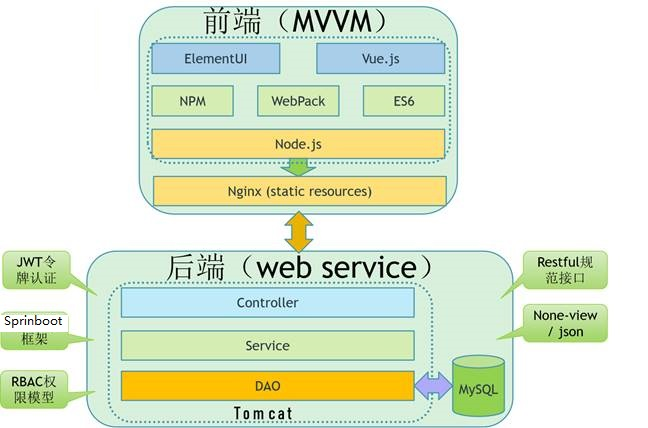

# WarmSearch-PC(校园失物招领网站)

## 前言：

🏫本人目前（2021年3月19日）是一名大二在校大学生从去年（2020年)5月开始准备自学java，从基础到框架，利用课余时间从JavaWeb开始，到SSM,到SpringBoot,再到前端Html5,CSS3,JS,Vue.js,最后到Node.js，学完之后开始着手开始做这个校园失物招领网站，目前该项目大概原型已经呈现出来，这是基于前后端分离项目，目前利用课余时间，不断完善改项目。小白开始，若有错误，还望大家多多指教。各部分源码将在Github上持续更新。

## 说明

> 本项目前后端分离，前端(WarmSearch-PC）[参考锤子商城](https://www.smartisan.com/)

> 这是本项目的前台源码，后端源码请看WarmSearch,本项目包括后台管理系统(WarmSearch-Web)，前台系统（WarmSearch-PC)，微信小程序部分（WarmSearch-uni-app)

> 如果您觉得这项目还不错，可以在右上角`Star`支持一下，万分感谢！！！

## 项目简介

- 本项目前后端分离，前端基于`Vue`+`Vue-router`+`Vuex`+`Element-ui`+`Axios`，参考锤子商城实现。后端基于SpringBoot(框架) + JSON WEB TOKEN(令牌机制) + MybatisPlus + Mysql实现。

- 总体架构

  系统设计秉承“前后端分离/SOA”的总体思想，前端使用Vue/ElementUI作为主要框架技术、Nginx作为HTTP服务器，用来提供静态页面访问服务和反向代理作用；后端则以Springboot主流框架技术为主、采用MySQL开源数据库，前后端使用Restful规范交换数据。 

  系统采用JWT令牌鉴权方式，降低服务器运行消耗，提升系统的伸缩性和扩展性。

- 总体架构

  总体设计按“前后端分离”方式，当浏览器请求页面或静态资源时，HTTP Server直接响应；当浏览器请求数据时，该请求仍然先发给HTTP Server，经由该Server转发至Web APP Server。Web APP Server业务处理后将结果数据返回给HTTP Server，最终返回浏览器。在此过程中，Web APP Server返回的仅仅是数据（json格式），没有任何与显示（视图）相关的信息，做到了完全的前后端分离，前端负责页面与展示，后端负责业务处理与数据。

## 技术栈

- 前台页面展示系统（WarmSearch-PC)：`Vue`+`Vue-router`+`Vuex`+`Element-ui`+`Axios`
- 后台管理系统：基于Vue-admin-ui脚手架
- 微信小程序：uni-app + Vue.js
- 后端：Springboot + Java Web Token +MybatisPlus + Swagger 框架
- 数据库：MySql

## 功能模块

## 运行项目

